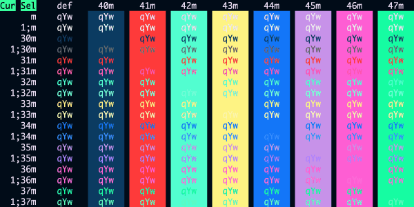

# MacSetup

A lightweight, idempotent shell script for provisioning a fresh macOS development machine. Install everything in one shot, or pick only the groups you need.

<p align="center">
  
</p>

## Purpose

This project exists so that setting up a new MacBook never means hunting through old notes or remembering which tools, fonts, and apps to install. Running `./setup` (or `./setup all`) restores a known-good development environment in a single, repeatable step: Homebrew, shell config, Node.js, CLI tools, GUI apps, fonts, and git identity profiles are all provisioned automatically. No more manual installs, no more "what was that one tool I always need?".

## Highlights

- **One-click install** - `all` provisions every group with no further prompts.
- **Modular groups** - Homebrew, shell, Node.js, CLI tools, applications, fonts, git profiles.
- **Per-group item picker** - opt into specific packages instead of the whole group.
- **Idempotent** - safe to re-run; existing installs and config blocks are skipped.

## Requirements

- macOS (Apple Silicon or Intel)
- Apple Command Line Tools (auto-installed if missing)
- Internet access

## Install

**One-shot via `curl`**:

```zsh
curl -fsSLO https://raw.githubusercontent.com/nh4ttruong/macsetup/main/setup && zsh setup
```

or clone for manually:

```zsh
git clone https://github.com/nh4ttruong/macsetup.git
cd macsetup
./setup
```

## Usage

```
./setup                Interactive menu
./setup all            One-click - install everything, no prompts
./setup <group>...     Install one or more specific groups
./setup -l | --list    List available groups
./setup -h | --help    Show help
```

The main menu accepts numbers (`1 3-5`), group names (`cli git`), `a` for everything, and `q` to quit. Groups that are already set up are marked with a green `✓`.

When you select a multi-item group (`cli`, `application`, `fonts`), the script lists each item with a one-line description, marks the ones already installed with `✓`, and asks how to proceed:

- `a` (or Enter) - install all items
- `1 3 5`, `1,3`, `2-4` - install only those items (commas and ranges both work)
- `n` - skip the group without touching anything
- `b` - back to the main menu (interactive mode only)
- `q` - quit

Invalid input re-prompts instead of exiting, and Ctrl-C/Ctrl-D exit cleanly. Choosing `all` from the main menu suppresses every per-group prompt.

Every run ends with a summary: what was installed, what failed, or `No changes made.` A single failed package no longer aborts the run - the script continues with the rest, reports the failures at the end, and exits non-zero. Colors are disabled automatically when output is piped, or when `NO_COLOR` is set.

### Examples

```zsh
./setup all              # install everything, no prompts
./setup brew cli git     # Homebrew + chosen CLI tools + git profiles
./setup terminal         # zsh completions + shell colors/prompt
./setup presets          # download presets to ~/Downloads
./setup application      # prompts for which applications to install
```

## Groups

| Group         | Summary                                                                                                                    |
| ------------- | -------------------------------------------------------------------------------------------------------------------------- |
| `brew`        | Install or update Homebrew                                                                                                 |
| `terminal`    | Install shell completions and configure `~/.zshrc` (ls colors + a custom colored prompt)                                   |
| `node`        | Install `nvm` and configure Node.js (default 26)                                                                           |
| `cli`         | Install common CLI tools: `git`, `make`, `jq`, `yq`, `nano`, `nanorc`, `pnpm`, `telnet`                                    |
| `application` | Install GUI applications: `visual-studio-code`, `iterm2`, `microsoft-edge`, `telegram`, `xkey`, `termius`, `orbstack`, `maccy`, `linearmouse`, `thaw` |
| `presets`     | Download bundled presets to `~/Downloads`                                                                                  |
| `fonts`       | Install developer fonts: `font-hack-nerd-font`, `font-fira-code`, `font-fira-code-nerd-font`, `font-dejavu`, `font-dejavu-sans-mono-nerd-font`, `font-hack`, `font-source-code-pro` |
| `git`         | Install fast git and configure identity profiles                                                                           |

`brew` is a prerequisite for install groups and is installed automatically when missing. The `presets` group only downloads files and does not require Homebrew. Missing per-group dependencies (e.g., `git` for the `git` group) are detected and you're prompted to install them in place.

> [!TIP]
> For a curated walkthrough of every bundled app, CLI tool, and font — with one-line notes on *why* each one is here — see [AWESOME-MAC-APPS.md](AWESOME-MAC-APPS.md).

<details>
<summary><b>cli</b> - included packages</summary>

`git`, `make`, `jq`, `yq`, `nano`, `nanorc`, `pnpm`, `telnet`

Nano syntax highlighting is enabled automatically after install.
</details>

<details>
<summary><b>application</b> - included casks</summary>

- [Visual Studio Code](https://code.visualstudio.com/)
- [iTerm2](https://iterm2.com/)
- [Microsoft Edge](https://www.microsoft.com/edge)
- [Telegram](https://telegram.org/)
- [XKey](https://github.com/xmannv/xkey)
- [Termius](https://termius.com/)
- [OrbStack](https://orbstack.dev/)
</details>

<details>
<summary><b>presets</b> - downloaded files</summary>

Defaults to `~/Downloads`; when run interactively, you can choose another destination. Downloads every file in [presets/](presets/), discovering files locally when cloned or from the GitHub API when running the standalone setup script.
</details>

<details>
<summary><b>fonts</b> - included casks</summary>

- font-hack-nerd-font
- font-fira-code
- font-fira-code-nerd-font
- font-dejavu
- font-dejavu-sans-mono-nerd-font
- font-hack
- font-source-code-pro
</details>

## Git profiles

The `git` group asks how many profiles you want (default 2) and lets you rename each one (defaults: `personal`, `work`).

- The **first** profile is set as the global git identity.
- All profiles are written to `~/.gitprofile.conf` (chmod 600).
- The [`bin/gitprofile`](bin/gitprofile) script is installed to `/usr/local/bin/gitprofile` (sudo may be required) and is immediately available on `$PATH`.

After setup, switch the local-repo identity in any project:

```zsh
gitprofile personal     # or whatever you named your profile
gitprofile work
gitprofile list         # show configured profiles
```

Profile labels can be any `[a-zA-Z0-9_-]+`. Re-run `./setup git` to update profiles.

> [!NOTE]
> `./setup all` (one-click) **skips** the git group because it requires interactive input. Run `./setup git` separately to configure profiles.

## Additional

### Config the input source with XKey preset

> [!NOTE]
> This section is for user who needs the application for Vietnamese input source

Download presets with `./setup presets`, then import `XKey-Settings.plist` from the XKey settings panel.

### Import iTerm2 profile

Download presets with `./setup presets`, then import `iterm2profile.json` from the iTerm2 settings panel.
"Edit" -> "Profile Preferences" -> "Import" (or just drag the JSON file onto the window)

> [!NOTE]
> You can use `coolnight.itermcolors` for a coolnight theme.



### Manual macOS settings

A few preferences are still easier to configure by hand in **System Settings**:

- **iCloud** - sign in and complete setup.
- **Dock** - enable auto-hide; adjust size.
- **Keyboard** - raise key repeat rate; add input sources (e.g. ABC, Vietnamese).
- **Trackpad** - tune tracking speed and gestures.

## Contributing

See [CONTRIBUTING.md](CONTRIBUTING.md).

## License

MIT

---

Made by [@nh4ttruong](https://github.com/nh4ttruong)
